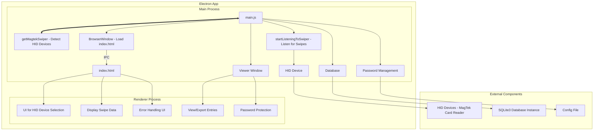

# **Wolfpack Guestbook General Documentation**

## **1. Introduction**

### **Project Name**
**Wolfpack Guestbook** - Version 1.0.5
### **Purpose**
Wolfpack Guestbook is an Electron-based desktop application designed to track attendance volume as a fully-enclosed software solution.  It processes card swipe data or virtual keystrokes to extract user identification information, optionally display the result to the screen, and store it to a local-only SQLite3 database. This can later be exported to CSV for further examination and analysis.

### **Target Audience**
This application is intended for internal use by staff managing attendance of events at Madison Area Technical College.

### **Overview**
The application automatically detects connected MagTek HID devices, allows the user to select an appropriate device if multiple are available. Once a HID device is selected, the application listens for card swipe events and key-press events for "F24". An anonymous entry is entered on F24, and on card swipe the parsed data is inserted to the database as well as displayed for the user.

---
---

## **2. Application Architecture**

### **Technology Stack**
- **Electron**: Cross-platform desktop application framework
- **Node.js**: JavaScript runtime environment
- **node-hid**: Node.js package for accessing HID devices
- **SQLite3**: Open-Source local-only database

### **High-Level Architecture**
#### Architecture Diagram


The application consists of the following main components:
- **Main Process (`main.js`)**: Manages the lifecycle of the application, creates the main window, handles IPC communications, and manages the HID listener.
- **Renderer Process (`index.html`)**: Displays the user interface and handles user interactions, such as selecting a HID device and displaying swipe data.
- **HID Device Module (`magtekSwiper.js`)**: Contains the logic for detecting, connecting to, and listening for data from HID devices.
- **SQLite3 Database(`db.js`,`GuestEntry.js`)**: Modules used to initialize and interact with the database.


### **Module Overview**

#### **main.js**
- Manages application lifecycle events (`ready`, `quit`, etc.).
- Creates the main application window and loads the UI from `index.html`.
- Handles IPC communication between the main process and the renderer process.
- Detects HID devices using `magtekSwiper.js` and starts the listener.

#### **magtekSwiper.js**
- Uses the `node-hid` library to detect available HID devices.
- Exposes functions for starting and stopping the listener, as well as selecting a HID device to listen to.
- Parses swipe data to extract user identification information (name and Onecard ID).

#### **index.html**
- The markup used by the renderer to display the UI, including options for selecting a HID device and displaying entry data.
- Handles user interactions and communicates with the main process via IPC.

#### **db.js**
- Uses Knex (Object-Relational Mapper) to start a SQLite3 database instance, and export a connection to that instance. It also defines the shape of the table and creates that table if it doesn't already exist.

#### **GuestEntry.js**
- Contains the individual functions used to interact with the table **"GuestEntry"** in the database. The names of each function tell you all you need to know about what they do.
  - create
  - createAnonymousEntry
  - findEntry
  - getAllEntries
  - flush

#### **promptPreload.js**
- Provides secure context bridge for password prompt windows
- Exposes limited IPC functionality to the renderer process

#### **promptRenderer.js**
- Handles UI interactions for password prompt windows
- Manages password input and submission

---
---


## **3. Security Considerations**

### **Data Handling**
- The application processes data from HID devices, specifically extracting user identification information such as name and Onecard ID from card swipes.
- Any data stored permanently is stored in cleartext locally on the SQLite database. No data is transmitted over any network interface.

### **IPC Communication**
- IPC (Inter-Process Communication) is used to facilitate communication between the main process and the renderer process.
- To minimize security risks, context isolation is enabled, and node integration is only used where necessary.

### **Device Access**
- The application requires access to HID devices, specifically card swipe readers.
- It uses the `node-hid` library to interact with these devices, which may require elevated permissions during setup on some systems.

### **Error Handling**
- Errors during HID device detection, connection, or data processing are logged to the console (only viewable before packaging) and displayed in the UI.
- The application ensures that errors do not crash the process, and users are informed of any issues they are able to resolve.

### **Password Protection**
- The viewer window can be optionally protected with a password
- Password is stored locally in a configuration file
- Password can be changed or removed through the viewer interface

---
---

## **4. Installation and Setup**

### **System Requirements**
- **Operating System**: Windows 10/11

### **Installation Steps**
1. Run the installer wolfpack-guestbook-setup.msi


### **Configuration**
- No additional configuration is required. The application will automatically detect connected HID devices or prompt the user on launch.

---

## **5. Operational Procedures**

### **Starting the Application**
- Run the application using the desktop shortcut placed by the installer on setup.
- The application window will open, and the detection of HID devices will begin automatically.

### **Normal Operation**
- If a MagTek MSR device is detected, the application will start listening for card swipes immediately. The key-down event listener for the key "F24" will also begin automatically.
- If no MagTek devices are detected, a dropdown will appear in the UI for the user to select the appropriate device. This is to allow other HID-enabled MSR devices to be used, should users prefer a different manufacturer.
- Swipe data is parsed and displayed in the application interface. That same data is saved to a row in the database locally. The key-down event "F24" also causes anonymous entry data to be displayed in the UI and a matching row is inserted to the table. There is a 2.5sec debounce timeout to prevent accidental duplicate entries of anonymous users, as they cannot be easily identified after being created.

### **Viewing and Exporting Data**
- Click the application logo to open the viewer window
- If password protection is enabled, enter the correct password to access
- View all entries in a tabular format
- Export data to CSV format for external analysis
- Flush all data with confirmation
- Set or change the viewer password

### **Shutting Down**
- Closing the application window will trigger the `before-quit` event to safely close the HID listener. This prevents any orphaned processes or threads from lingering after the UI is closed.
- The application will ensure all resources are released before quitting. No threads remain open/running after the main thread is terminated.

---
---

## **6. Maintenance and Support**

### **Updating the Application**
- As of the initial release, no plans for additional functionality have been made and no support or updates are to be provided.

### **Known Issues and Limitations**
- The application does not support all types of HID devices; it is specifically designed for MagTek card readers. Users may attempt other MSR devices but they must be HID-capable.
- If the HID device is disconnected during operation, the application may need to be restarted.

### **Troubleshooting**
- **No HID devices detected**: Ensure the device is properly connected and recognized by the operating system. You may need to install appropriate drivers.
- **Application crashes**: Uninstall the application via the Windows appwiz.cpl control panel interface and reinstall with the provided installer.

---
---

## **7. Compliance and Legal Considerations**

### **Licensing**
- This application is closed-source, and it's contents (not including dependancies) are to be treated as propriatery.
- This application's license will be transferred to Madison Area Techncial College upon approval.
- Dependencies are licensed for commercial use under open-source licenses (see `package.json` for details).

### **Data Compliance**
- The application does not transmit personal data beyond the scope of the computer it is installed on; however, it is designed to process user identification information. Ensure compliance with local data protection regulations if modifications are made that affect data handling. Data created is not encrypted or obfuscated in any way.

---
---

## **8. Conclusion**

### **Final Notes**
- This documentation provides a comprehensive overview of the Wolfpack Guestbook Application, its architecture, security considerations, and operational procedures.
- Please refer to the appendices for additional technical details and troubleshooting tips.

### **Contact Information**
- **Developer**: Dave Luhman
- **Email**: dave@ado.software
- **GitHub**: https://github.com/DaveLuhman

---
---

## **9. Appendices (Optional)**

### **Code Samples**
- **Parsing Swiped Card Data**:
   ```javascript
    const parseSwipeData = (data) => {
    try {
        const regex = /(?<=\^)(.*?)(?=\^)/ // Regular Expression to match anything between two carets (^)
        const rawName = regex.exec(data) // executes the above Regex against the swipe data
        const name = rawName[0].trim() // removes any whitespace from before and after the matched name
        const onecardRegex = /(\d{7})\s{3}/ // Regular Expression to match the seven digits preceeding whitespace of 3 or more characters
        const onecard = onecardRegex.exec(data) // executes the above regex against the swipe data
        return { onecard: onecard[0].trim(), name } // returns the whitespace-trimmed onecard and name values as an POJO
    } catch (error) { // error handling
        console.log(error.message) // logs error message to console.
        throw new Error('Unable to determine Onecard/Name from provided input') // hoists error to function caller to handle
    }
    }
   ```

### **Changelog**
- **Version 1.0.0**: Initial release.
- **Version 1.0.1**: Fixed an issue where the application would not display swipe data.
- **Version 1.0.2**: Fixed an issue where the application would crash if no HID devices were detected.
- **Version 1.0.3**: Fixed an issue where the application would not detect new HID devices.
- **Version 1.0.4**: Added password protection to the viewer window.

### **Dependency List**
- **Electron**: MIT License
- **node-hid**: MIT License

